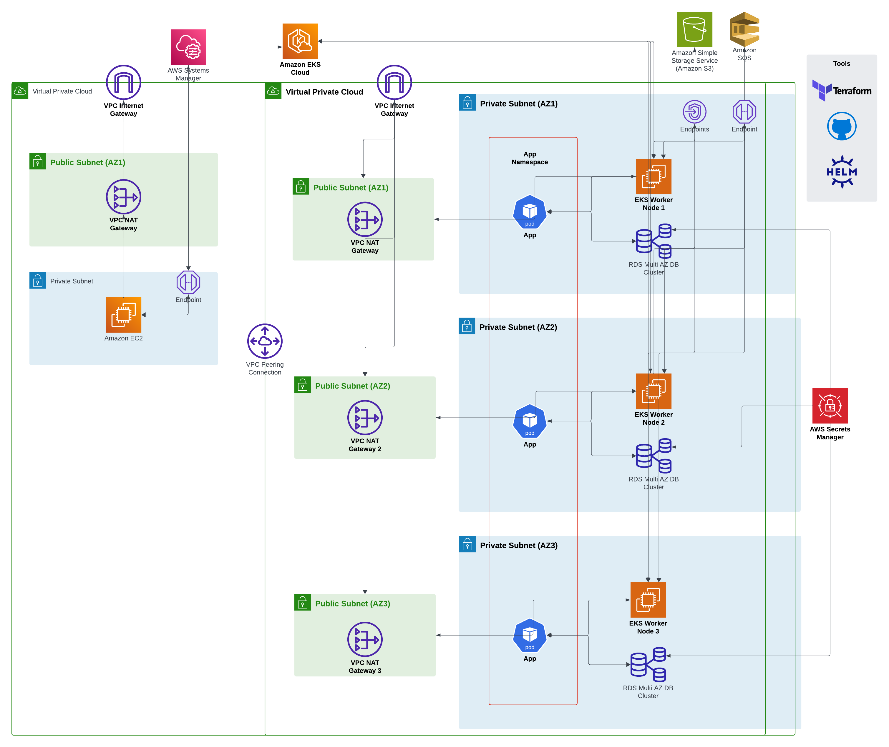

# EKS Private Cluster

## High Level Architecture Diagram


## Overview
This repository contains Terraform code to deploy a private Amazon Elastic Kubernetes Service (EKS) cluster and its supporting services, including Aurora MySQL, S3, SQS, ACM, and VPC peering, using a modular architecture. This project works in tandem with the SSM Private Access project to ensure secure, internet-free communication within AWS, leveraging private VPC networking and VPC endpoints.

## Objective
The goal of this project is to deploy a secure, private Kubernetes infrastructure integrated with Systems Manager (SSM) for management and communication, ensuring:
- Private EKS cluster deployment with no direct internet access
- Seamless integration of services like Aurora MySQL, S3, SQS, and ACM without using the public internet
- Seamless integration with the SSM Private Access project for enhanced management capabilities
- Secure, private communication between services using VPC peering and VPC endpoints
- Scalable, modular architecture for easy customization and extension

## Interconnection with SSM Private Access
This project builds upon the infrastructure set up by the SSM Private Access repository:
- SSM Role Integration: The IAM roles and instance profiles created in the SSM project are reused to allow EKS nodes to interact with SSM securely
- Shared Networking: The private subnets and VPC endpoints established in the SSM project form the backbone for the EKS cluster's networking
- VPC Peering: This project establishes VPC peering to allow secure communication between the EKS VPC and other VPCs configured in the SSM project

## Features
### Modular Design
- Independent modules for key infrastructure components:
- - EKS cluster
- - Karptenetes with Fargate for autoscaling
- - Aurora MySQL (RDS) for database
- - S3 bucket for storage
- - SQS messaging for communication
- - ACM for SSL certificates
- - External DNS for DNS management
- - VPC peering for secure communication between VPCs 

## Infrastructure Components
### Private EKS Cluster
- Fully private EKS cluster with no direct internet access
- odes deployed in private subnets with access to private VPC endpoints
- Cluster logs sent to CloudWatch for monitoring and auditing

### Karptenetes with Fargate
- Karpenter is configured to autoscale the EKS cluster 
- Initial Faragate profile is created to deploy Karptenetes pods

### Aurora MySQL (RDS)
- Aurora MySQL cluster with:
- - One writer instance
- - Multiple reader instances for high availability
- IAM database authentication enabled for secure access
- Encrypted storage, configurable backups and maintenance windows

### Amazon SQS
- Private SQS queues with IAM role-based access control
- VPC endpoints for private communication with other services

### Secure Networking
- VPC peering for cross-VPC communication
- NAT gateways for controlled internet access
- Security group rules to restrict access to private resources

### ACM and External DNS
- SSL certificates managed by ACM for secure communication
- Cloudflare DNS integration for DNS validation and management with External DNS

## Repository Structure
```
eks-private-cluster/
├── main.tf                 # Root module orchestrating the setup
├── variables.tf            # Input variables for the project
├── outputs.tf              # Outputs for the resources created
├── modules/                # Modular infrastructure components
│   ├── vpcpeer/            # Handles VPC peering
│   │   ├── main.tf
│   │   ├── variables.tf
│   │   ├── outputs.tf
│   ├── eks/                # EKS cluster configuration
│   │   ├── main.tf
│   │   ├── variables.tf
│   │   ├── outputs.tf
│   ├── sqs/                # SQS configuration
│   │   ├── main.tf
│   │   ├── variables.tf
│   │   ├── outputs.tf
│   ├── rds/                # Aurora MySQL cluster configuration
│   │   ├── main.tf
│   │   ├── variables.tf
│   │   ├── outputs.tf
│   ├── acm/                # ACM certificate configuration
│   │   ├── main.tf
│   │   ├── variables.tf
│   │   ├── outputs.tf
│   ├── externaldns/        # External DNS integration with Cloudflare
│       ├── main.tf
│       ├── variables.tf
│       ├── outputs.tf
├── terraform.tfvars        # Sample input variables file
├── provider.tf             # AWS provider configuration
```

### Resource Naming Convention
- {project}-{environment}-{resource-type}-{sequence}
- Example: ssm-prod-endpoint-001

## Prerequisites
### Required Tools
- Terraform >= 1.10
- AWS CLI >= 2.0

## Deployment Workflow
1. Deploy the SSM Private Access Project located in the SSM Private Access repository: https://github.com/lokesh1306/ssm-private-access

2. Deploy the EKS Private Cluster Project using the steps below:
### Deployment Guide
#### Initial Setup
1. Clone repository
2. Configure AWS credentials
3. Update terraform.tfvars

#### Deployment Steps
Initialize Terraform
```
terraform init
```
Validate Terraform configuration
```
terraform validate
```
Plan Terraform changes
```
terraform plan
```
Apply Terraform changes
```
terraform apply
```

### Access Resources
- Application: A demo application has been deployed to the EKS cluster using the app module, which includes a sample LoadBalancer service, you may access it using the domain name used in the terraform.tfvars file
- Database: The Aurora MySQL cluster can be accessed using the endpoint and credentials stored in the AWS Secrets Manager. Use the credentials to create a MySQL user on the Aurora MySQL cluster and the application pod includes 'cli' container which uses ServiceAccount configured with IRSA to generate temporary credentials using aws rds generate-db-auth-token command
- SQS: The SQS queues can be accessed using the queue URLs and IAM Role for Service Account. The application pod includes 'cli' container which uses ServiceAccount configured with IRSA to access the queues
- S3: The S3 bucket can be accessed using the bucket name and IAM Role for Service Account. The application pod includes 'cli' container which uses ServiceAccount configured with IRSA to access the queues
- Pods: The application includes a 'kubectl' container which can be used to access the pods in kube-system namespace, restricted via RBAC

## SSM Access/Debug Commands

### Access EC2 Instance
```
aws ssm start-session --target <instance-id>
```

### Verify endpoints  
```
aws ec2 describe-vpc-endpoints --vpc-endpoint-ids <endpoint-id>
```

## Multiple Environments
In order to deploy this infrastructure in multiple environments without duplicating the code and while maintaining distinct Terraform state files, I'd recommend using Terraform Workspaces
1. **Create a new workspace:**
   ```bash
   terraform workspace new workspacenew
2. **Switch to the new workspace:**
   ```bash
   terraform workspace select workspacenew 
3. **List workspaces:**
   ```bash
   terraform workspace list 
4. **Delete a workspace:**
   ```bash
   terraform workspace select default 
   terraform workspace delete workspacenew 

## Notes
- Ensure you have necessary permissions in your AWS account to create these resources
- Always review the Terraform plan before applying to understand the changes that will be made to your infrastructure
- Ensure you have set up billing alerts in your AWS account to avoid unexpected charges
